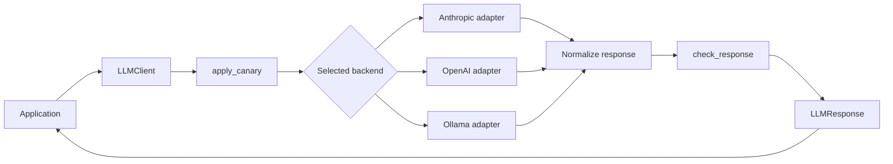
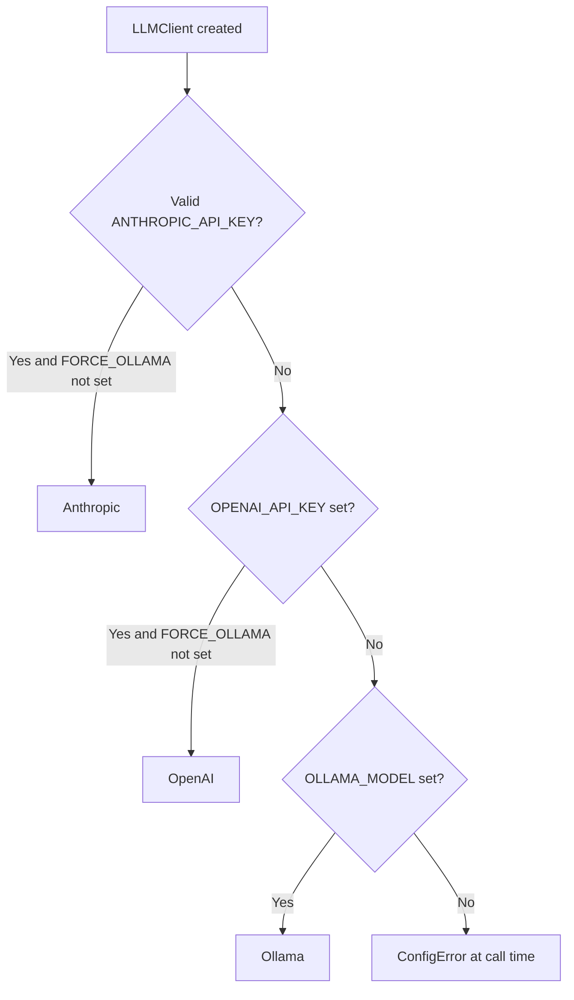

# Architecture

## Design Goal

Waygate AI keeps provider-specific LLM behavior behind a small, stable client API.
Applications should not need to know which SDK call shape, token metadata shape,
or retry mapping each provider uses.

## Request Flow

## Backend Detection

## Package Map

| Path | Responsibility |
|---|---|
| `waygate_ai/__init__.py` | Public exports. |
| `waygate_ai/client.py` | Client orchestration, retries, response metadata. |
| `waygate_ai/config.py` | Backend detection, defaults, cost estimates. |
| `waygate_ai/security.py` | Prompt-injection guard helpers. |
| `waygate_ai/exceptions.py` | Exception hierarchy. |
| `waygate_ai/providers/anthropic.py` | Anthropic SDK adapter. |
| `waygate_ai/providers/openai.py` | OpenAI SDK adapter. |
| `waygate_ai/providers/ollama.py` | Ollama OpenAI-compatible HTTP adapter. |

## Boundary

Waygate AI owns model access concerns. Consuming applications own:

- user experience
- domain prompts
- business rules
- persistence
- authentication and authorization
- deployment-specific secret management
