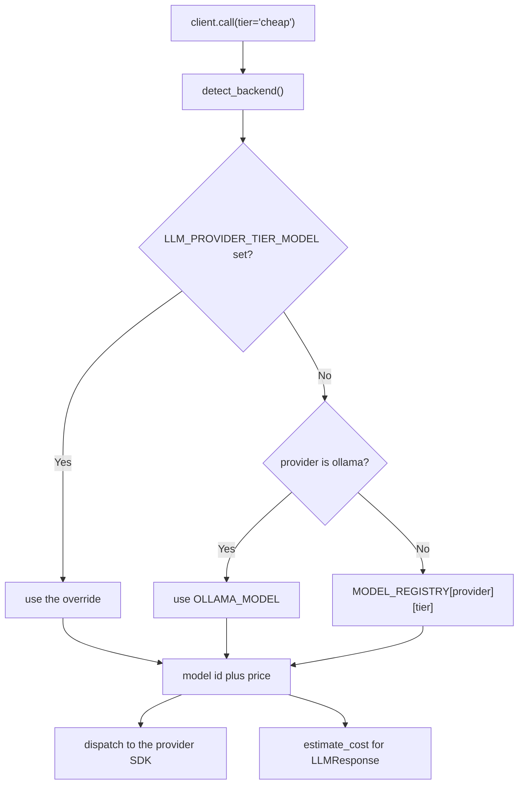

# Model Routing

**Declare a tier. Waygate picks the model.**

Model selection is a provider concern, not an application concern. Your code
should be able to say *"this task needs the cheap tier"* and never learn the name
of a model.

```python
from waygate_ai import LLMClient

client = LLMClient()

client.call(system="Classify this ticket.", user=text, tier="cheap")
client.call(system="Answer from the docs.",  user=q,    tier="premium")
```

The same code runs against Anthropic in production, OpenAI on a different
deployment, and Ollama on a laptop. Nothing in the application changes.

---

## The three tiers

| Tier | For | Anthropic default | OpenAI default |
|---|---|---|---|
| `cheap` | High-volume mechanical work: classify, extract, tag, route. | `claude-haiku-4-5` | `gpt-5.4-mini` |
| `standard` | The default for real work: summarize, parse, analyze. | `claude-sonnet-4-6` | `gpt-5.4` |
| `premium` | The small slice that genuinely needs a frontier model. | `claude-opus-4-8` | `gpt-5.5` |

Ollama collapses every tier onto `OLLAMA_MODEL` — one local model serves all
three, which is what you want on a developer machine.

!!! tip "Start cheap, promote on evidence"
    Production routing studies consistently find only ~8–16% of tasks need the
    premium tier, while humans left to choose pick premium ~85% of the time.
    Declare a new touchpoint at `cheap` and promote it only when a bake-off shows
    the cheaper tier actually failing — not on the assumption that it will.

---

## Routing is priced

`MODEL_REGISTRY` maps `(provider, tier)` to a `ModelSpec` that carries the model
id **and its price**:

```python
from waygate_ai import MODEL_REGISTRY

MODEL_REGISTRY["anthropic"]["premium"]
# ModelSpec(model_id='claude-opus-4-8', cost_in=5.0, cost_out=25.0)
```

Pairing them is deliberate. A router that cannot price a model cannot route on
price, and a cost table maintained separately from the routing table drifts out
of sync — which is exactly how a model ends up silently billing at `$0.00`.

If a model has no registered price, `cost_usd` is still `0.0` — but Waygate
**logs a warning** (once per model id) saying so:

```text
WARNING waygate_ai.router: No price registered for model 'some-model' --
cost_usd will be reported as 0.00 for every call on this model.
```

A model that quietly costs nothing is indistinguishable from a model that is
genuinely free. That ambiguity is how a cost dashboard reads `$0.00` for a month
of production traffic, so Waygate refuses to be silent about it.

!!! warning "OpenAI tiers ship unpriced"
    The OpenAI models route correctly but carry no price, because guessing a
    price is worse than admitting you don't have one. They report `$0.00` and
    warn. Populate `cost_in` / `cost_out` in `waygate_ai/router.py` from OpenAI's
    published pricing to enable cost telemetry on that path.

---

## Overriding a tier per deployment

Any tier can be re-pointed with an environment variable — no code change:

```bash
LLM_<PROVIDER>_<TIER>_MODEL=<model-id>
```

```bash
# A demo environment caps its bill by serving "premium" from Sonnet.
LLM_ANTHROPIC_PREMIUM_MODEL=claude-sonnet-4-6
```

The override wins over the registry default. This is the intended way to bias an
environment cheaper, pin a snapshot, or roll out a new model to one deployment
first.

---

## Cache-aware sessions

Providers cache the prompt prefix, and a cache read costs roughly a **tenth** of
a fresh input token. That cache is keyed to the model: **switch models
mid-conversation and the entire cached prefix is discarded and re-billed at full
price.**

This is the trap that makes naive routing *lose* money. Route a long chat
turn-by-turn — cheap tier for "ok", premium for the hard follow-up — and every
switch dumps a cache that was about to pay for itself. On a conversation of any
length, always-premium-and-cached can beat cleverly-routed-and-uncached outright.

**So the rule is: route *between* conversations, never *within* one.**

- **One-shot work** (classify, extract, summarize) has no cache to protect.
  Route freely, per call.
- **Multi-turn chat** resolves its tier **once** and holds it for the life of the
  conversation.

Use a `Session` for the second case:

```python
session = client.session(tier="premium")   # tier resolved once, here

for turn in conversation:
    response = session.call(system=SYSTEM_PROMPT, user=turn)

session.model   # the one model every turn ran on
```

The session pins the **model**, not the history — you still own the transcript
and pass it in each turn.

!!! note "Keep the system prompt byte-identical across turns"
    The system prompt is the head of the cached prefix. Changing it between turns
    invalidates the cache just as a model switch would. Interpolating a timestamp
    or a request id into it is the most common way to silently lose every cache
    hit.

---

## How a tier becomes a model



Tier resolution and dispatch read the **same** `detect_backend()` result, so a
tier can never resolve to a model belonging to a provider other than the one that
gets called. (Consumers that reimplemented provider detection to do their own
routing had drifted from `detect_backend` on both key validation and
`FORCE_OLLAMA` parsing — routing in the gateway removes the second implementation
entirely.)

---

## Escape hatch: naming a model directly

`model=` still pins an exact model id and bypasses the router:

```python
client.call(system=..., user=..., model="claude-opus-4-8")
```

Use it for a one-off — reproducing a bug, an eval harness sweeping models. Prefer
`tier=` everywhere else; it is the whole point.

Passing both `model=` and `tier=` raises `ValueError`. They mean different things
and silently letting one win would be a trap.
